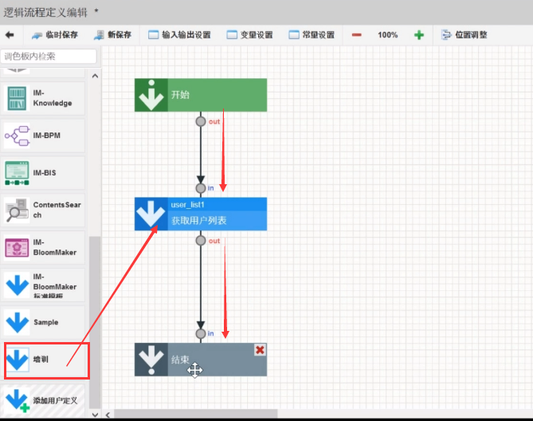
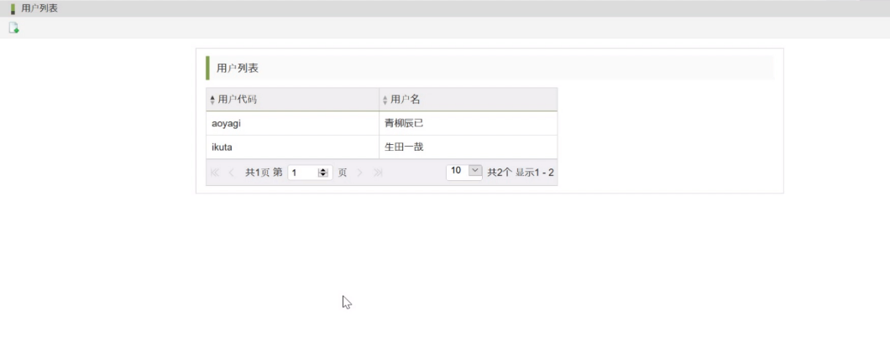
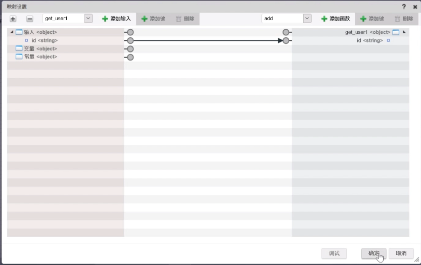
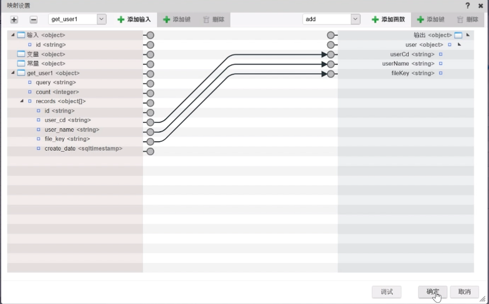
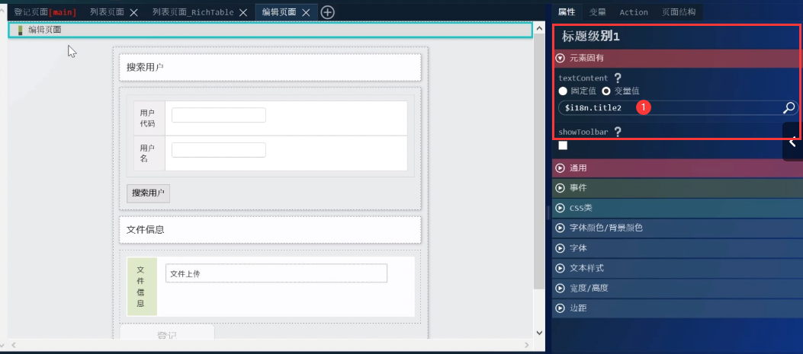
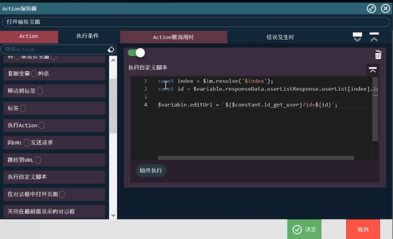
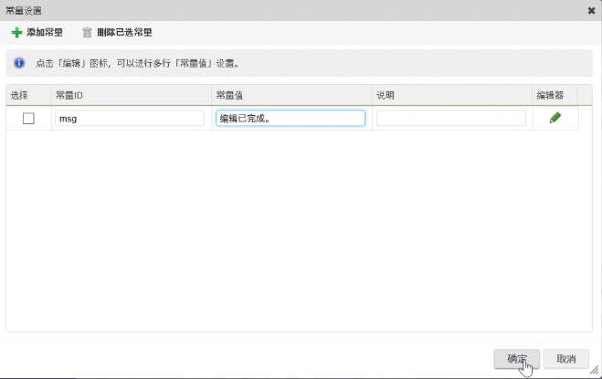
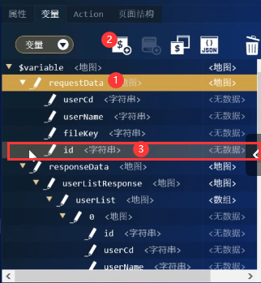
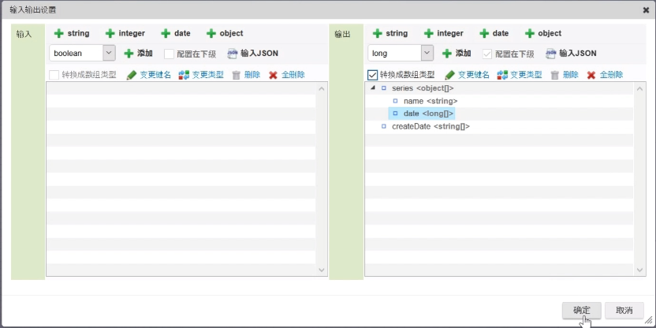

- [IM-Bloommaker](#im-bloommaker)
  - [1. Hello world](#1-hello-world)
  - [2. 创建Repository的词典项目和实体](#2-创建repository的词典项目和实体)
  - [3. 用户搜索事例](#3-用户搜索事例)
  - [4. 登记用户信息(上传文件控件和登记按钮)](#4-登记用户信息上传文件控件和登记按钮)
  - [5. 自定义脚本四则运算](#5-自定义脚本四则运算)
  - [6. 自定义脚本获取当前日期](#6-自定义脚本获取当前日期)
  - [7. 用户列表页面](#7-用户列表页面)
  - [8. 用户列表页面\_RichTable](#8-用户列表页面_richtable)
  - [9. 用户编辑页面](#9-用户编辑页面)
  - [10. 用户编辑页面\_RichTable](#10-用户编辑页面_richtable)
  - [11. 用户信息编辑处理](#11-用户信息编辑处理)
  - [12. 制作图表页面](#12-制作图表页面)

# IM-Bloommaker  
  
---

## 1. Hello world

1.   
2.   
3. 创建分类  
4. 输入内容名Hello World 点击登记  
5. 点击设计编辑 进入设计界面  
6. 新建名为nameValue变量值, 将其绑定到文本框的value设置为变量值, 修改按钮的value名为提交  
7. 新建一个节面 放入一个标题级别小窗口 放入标签 将标签元素固有设定为nameValue变量值  
8. 设置action 在对话框中打开界面2  
9. 设置关闭对话框action   
10. 绑定action到按钮   
11. 点击预览, 并保存  
12. 点击路由定义一览表 并新建分类 设置分类ID,分类名  
13. 新建路由 设置路由ID, URL, 选择内容(创建好的Hello World) 路由名称中输入Hello World后点击登记按钮 路由创建完毕  
14. 设置权限 为认证用户设置权限  

## 2. 创建Repository的词典项目和实体  

1.   
2. 新增类别, 再选中状态下新建项目 勾选用途中的"数据和限制" 设置词典项目ID和名为: userID
3. 类型模板选择text 变量名设置都为userCd 在限制栏中选择字母和数字 点击添加限制: 仅小写字母 选择UserCd后点击添加限制  
4. 新建项目2 勾选用途中的"数据" 设置词典项目ID和名为: userName.
5. 数据的类型模板选择text 变量名设置都为userName
6. 点击影响范围确认按钮后 在注释栏中 输入"创建词典项目" 点击提交
7. 网站地图 Repository中实体一览列表 
8. 新增类别, 再选中状态下新建实体 点击编辑实体项目 选中之前创建的userCd和userName 点击创建 影响范围确认的注释栏中输入"登记实体" 并保存
9. 词典项目成功登记到词典中  

## 3. 用户搜索事例

1. 在BloomMaker内容一览表中 新建内容 id 名为 user_edit 登记页面
2. 设计界面 输入实体选项中选择登记页面
3. 修改key1名为requestDate
4. 选择多语言 新建   用表格查看创建的多语言
5. 放入标题级别1 选中标题 为其设置 多语言中的title
6. 布局中 放入"框" 在布局imui中选择横向表格 放入刚刚的"框" 修改固有元素为2
7. 放入表单控件中的 按钮, 放入两个输入文本到表格右侧
8. 设置元素名及变量
9. 设置action 显示点选用户搜索对话框 设置用户代码和用户名
10. 点击"搜索用户" 设置事件

## 4. 登记用户信息(上传文件控件和登记按钮)

1. 数据库操作菜单
2. SQL文件导入
3. 使用IM-logicDesigner制作用户登记信息action然后转换成restAPI以url的形式提供给IM-BloomMaker的action来调用
4. 网站地图下流程定义一览 点击新建
5. 输入输出设置 登记用户没有返回值 所有没有输出
6. 设置常量
7. 打开sql定义编辑
8. 
9. sql定义查询链接 设置查询类型为insert
10. 
11. 
12. 
13. 连接起来
14. 双击等级用户元素 一一映射 
15. 发布至directmessagebox设置映射 
16. 设置分支元素  当有文件上传时处理表达式
17. 等级文件信息元素 
18. 
19. 新保存
20. 设置路由
21. 许可设置
22. 进入BloomMaker一览表菜单
23. 设置filekey
24. 新建常量
25. 设置多语言
26. "搜索用户按钮"移动至框内
27. 放入表单容器
28. 把框放到表单标题下表格rowCount修改为1
29. 设置多语言
30. 表单控制下文件上传放到文件信息表格内 设置textContent多语言
31. 设置action:登记处理
32. imui显示信息
33. 设置点击登记按钮时 不为空
34. 设置登记按钮action
35. 设置文件上传的value
36. 设置完成

## 5. 自定义脚本四则运算

1. BloomMaker内容一栏表下新建内容 
2. 放入标题级别1 命名为自定义脚本练习
3. 放入表单容器 删除除标题级别2以外内容 重命名为变量操作
4. 表单控件下输入数值 放入两个输入数值在表单标题下方 再放入一个下拉框再两个数值中间
5. 通用下放入标签在数值右侧 固定值修改为"="
6. 布局下 放入两个"框"在表单容器最下方
7. 表单控件下按钮放入第一个"框" value修改为"计算"
8. 输入数值放入第二个"框"
9. 页面设置如下
10. 设置变量 
11. 设置四则运算action
12. 设置执行条件 
13. 设置"计算"按钮事件为"计算"
14. 保存 设置路由

## 6. 自定义脚本获取当前日期

1. BloomMaker内容一栏表下新建内容
2. 设计编辑 -> 放入标题级别1 -> 设置textContent固定值为"自定义脚本练习2" -> 放入表单容器 -> 设置textContent为变量操作(日期) -> rowCount为2 -> heading元素的textContent固定值为"获取日期" -> 第二个heading为"正则表达式" -> 放入两个输入文本到表格右侧
3. 设置变量 如下四个变量
4. 设置action"获取日期" 放入两个自定义脚本 输入Javascript获取当前年月日date方法 第二个自定义脚本中 使用正则表达式转换date方法获取的日期 然后格式化返回值给先前设置的变量today
5. 设置输入框value
6. 下方输入框value设置为today
7. 设置读取页面时
8. 保存 显示预览
9. 新建路由
10. 为认证用户设置权限

## 7. 用户列表页面

用户信息一览表页面用来显示在前面[登记用户信息](#4-登记用户信息上传文件控件和登记按钮)已登记的用户信息  
先从表中获取登记信息 再制作用户信息一览表  

1. 网站地图 -> LogicDesigner -> 流程定义一览 -> 新建
2. 输入输出设置 
3. 添加用户定义
4. 用户定义ID: user_list 用户定义名: 获取用户列表
5. 用户类别检索 选中 "tutorial"ID "培训"类别名
6. SQL定义 -> 取得数据定义 
7. 值被自动显示到返回值栏中 
8. 连接元素 
9. 双击结束元素 映射设置
10. 新保存
11. 网站地图 -> LogicDesigner -> 路由表定义一览
12. 设置认证用户许可
13. BloomMaker内容一栏表下 -> 登记页面 设计编辑
14. 新建 列表页面 设置为main页面 
15. 设置变量 
16. 设置常量
17. 多语言设置 list, edit, title2
18. 列表页面放入 标题级别1 textContent设置多语言list
19. 设置工具栏列表item
20. 放入表单容器 将除标题级别2以外元素删除 设置其textContent变量值为多语言的list
21. 重复(imui)下 纵向表格 放入表单容器内 设置list元素为"userList" 
22. 设置第一个heading textContent变量值为多语言
23. 设置第二, 三个heading textContent变量值为多语言 
24. userList[0] -> userList[index]  
25. 设置一个图标
26. 设置action 
27. 
28. 刷新图标
29. 保存 预览 

## 8. 用户列表页面_RichTable

1. BloomMaker内容一栏表下 -> 登记页面 设计编辑
2. 新建列表页面richtable -> 设置为main页面 
3. 复制列表页面 标题级别1 和 表单容器 到 列表页面_RichTable -> 删除纵向表单(重复) -> 放入RichTable
4. 新建变量  
5. header下创建下级变量  
6. 设置元素
7. 保存 预览

## 9. 用户编辑页面

1. 网站地图 -> LogicDesigner -> 流程定义一览 -> 新建
2. 输入输出设置 
3. 用户定义SQL新建   
4. 获取用户信息sql语句 即在返回值栏中显示出 删除原有的输入值 新建一个
5. 
6. 获取用户 映射设置
7. 结束元素 映射设置
8. 新保存 
9. 设置路由 
10. 设置认证用户许可
11. BloomMaker内容一栏表下 -> 登记页面 设计编辑
12. 新建页面 命名为编辑页面 复制登记页面 标题级别1 和 表单容器 到 编辑页面 修改标题1 元素固有
13. 编辑按钮 
14. 删除搜索按钮
15. 新建变量 editUrl 
16. 新建responseData下变量 
17. 选择userEditResponse新建变量 
18. 选择user新建变量 
19. 同样方法新建两个userName 和 fileKey 变量
20. 设置常量 
21. 设置用户代码value
22. 设置用户名value 
23. 设置文件上传value
24. 创建一个从列表页面跳转到编辑页面的action
25. 执行自定义脚本 
26. 向URL发送请求 
27. 打开页面设置为编辑页面 确认! 
28. 返回列表action
29. 标题栏 中 设置showToolBar为选中状态 删除更新图标 
30. 点击返回图标 设置事件 

## 10. 用户编辑页面_RichTable

1. BloomMaker内容一栏表下 -> 登记页面 设计编辑
2. 选择列表页面_RichTable 设为main页面
3. 新建action 
4. 向URL发送请求 
5. 设置打开页面 -> 决定 
6. 选择RichTable属性下 

## 11. 用户信息编辑处理

1. 网站地图 -> LogicDesigner -> 流程定义一览 -> 新建
2. 输入输出设置 
3. 常量设置 
4. SQL定义新建  sql语句定义
5. 删除createDate变量 
6. 编辑流程
7. 编辑用户 映射设置 
8. 登记文件信息 映射设置 
9. 分支条件设置  
10. 新保存 
11. 路由表定义一览 设置路由 
12. 认证用户权限设置
13. BloomMaker内容一栏表下 -> 登记页面 设计编辑
14. 变量requestData下新建变量 
15. 新建常量  
16. 新建action  向uRL发送请求 显示信息
17. 编辑按钮 事件下 点击时"编辑处理" 
18. 删除编辑按钮中disabled中的变量值
19. 保存

## 12. 制作图表页面

用来实时显示登记在这张表中的所有数据的情况  

1. 网站地图 -> LogicDesigner -> 流程定义一览 -> 新建
2. 输入输出设置 
3. 用户定义 SQL定义新建  
4. 输入值栏中变量删除 
5. 
6. 打开 结束 映射设置 
7. 新保存 
8. 设置除饼图外其他图表 
9. 常量设置 
10. 用户定义 SQL定义新建 
11. SQL定义 
12. 输入值栏中变量删除 
13. 用户定义 -> JavaScript定义新建 
14. 输入值返回值栏中变量设置
15. JavaScript定义 
16. 连接流程
17. 图标结果数组操作 映射设置 
18. 结束 映射设置 
19. 新保存 
20. 登记其他图标路由 
21. 登记饼状图标路由 
22. 设置认证用户许可
23. 新建  
24. 设计编辑 放入标题级别1 textContent设置为 "图表显示"
25. 将图表下 饼图, 折线图, 柱状图, 雷达图放入右侧
26. 设置变量 
27. 设置常量  
28. 设置action  
29. 容器设置 
30. 设置饼图属性 
31. 设置折线图属性  series选项中 
32. 设置柱状图属性   series选项同上
33. 设置雷达图属性 同上
34. 选中标题级别1 showToolbar选项打勾 删除更新图标
35. 返回图标修改为新建图标 
36. 设置herf为登记页面的URL 点击新建图标后 就会跳转至登记页面 
37. 保存 -> 新建路由 
38. 设置认证用户许可
39. 设置门户 
40. 新建图标   
41. 设置权限 
42. 组门户管理菜单
43. 门户组件添加 
44. 设置参照权限 
