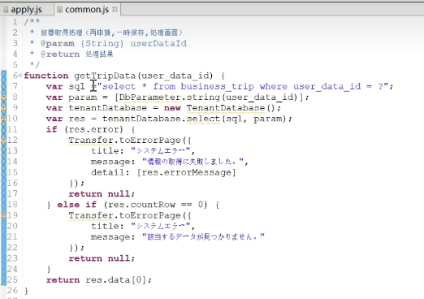
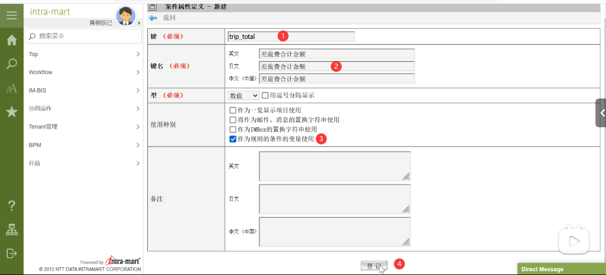
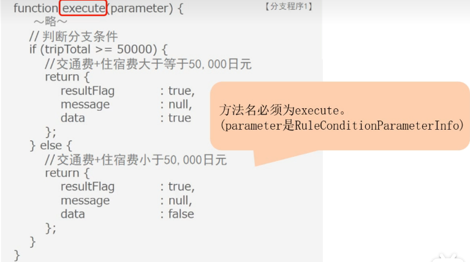
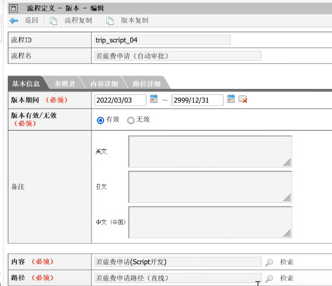

# IM-Workflow开发

- [IM-Workflow开发](#im-workflow开发)
  - [目的](#目的)
  - [1. IM-Workflow的初始设置](#1-im-workflow的初始设置)
  - [2. 申请页面 Action处理 临时保存/再申请页面](#2-申请页面-action处理-临时保存再申请页面)
  - [3. 处理页面 详细页面](#3-处理页面-详细页面)
  - [4. 案件属性的使用方法](#4-案件属性的使用方法)
  - [5. 使用API进行申请](#5-使用api进行申请)
  - [6. 用户程序](#6-用户程序)
  - [7. 处理对象插件](#7-处理对象插件)

## 目的

通过使用标准页面来制作申请/处理页面的要点, 用户程序的编写要点, 案件属性的使用方法, 自定义制作添加处理对象者的方法, 以及不通过使用标准页面来进行申请的方法等.

## 1. IM-Workflow的初始设置

1. 准备工作
2. 设置用户管理员身份 通用主表 -> 用户 -> 检索 -> 编辑
3. 用户详细 -> 身份 -> 添加 -> 检索 -> 更新 
4. [设置工作流]使用IM-Workflow申请案件, 必须设置内容定义, 路径定义和流程定义

   - 内容定义用来保存 和页面, 用户程序, 邮件模板等IM-Workflow处理内容相关的信息
   - 路径定义用来保存从申请到最终确认的处理流程 及 被处理者的信息
   - 流程定义用来关联内容定义和路径定义, 对个节点进行详细设置, 构成在实际操作时可以进行申请的工作流
5. 内容定义_登记页面 
6. 再申请页面 
7. 内容定义_登记用户程序 
8. 路径定义  完成预览 
9. 流程定义 
10. 设置完成

## 2. 申请页面 Action处理 临时保存/再申请页面

1. 申请页面 --- 输入申请内容后, 进行申请 的页面
2. action处理 --- 在完成申请后, 执行的用户程序
3. 临时保存/再申请页面 --- "临时保存申请内容"的页面 和 "可以进行重新申请"的页面
4. 使用到的表  sql语句 
5. 申请一览表 -> 流程 -> 可以看到上一节创建的流程
6. apply.html调用js 
7. 调用申请模态 
8. processParameter方法可以传入初始值 
9. optionalParameter方法处理 
10. rebootModal参数 即使设置的是false, 只要返回一览表页面, 或做了别的页面跳转操作, 之前输入的内容就会被删除 
11. [action处理]action处理是在申请等处理执行完之后, 在该处理所在同一事务中被调用的处理.
12. 点击申请按钮后的执行顺序: 事务开始 -> 申请处理 -> action处理 -> 事务结束
13. action处理 进行申请处理的方法名必须是"apply"
14. 
15. business_trip表中的user_data_id字段是做什么的?

    - 首先看一下工作流的数据 工作流进行申请后的信息分为2大类: "用户应用程序数据" 和 "IM-Workflow数据"
    - 用户应用程序数据: 用户输入的信息
    - IM-Workflow数据: 无论什么业务, 都需要IM-Workflow端的信息 IM-Workflow数据通过系统案件ID(systemMatterId)这个主键来管理IM-Workflow端的数据
    - systemMatterId在进行申请时由IM-Workflow模块编号而来
    - 用户应用程序数据 和 IM-Workflow数据 通过用户数据ID(userDataId)进行关联
    - userDataId一般都是在进行申请处理时由IM-Workflow模块进行编号, 但userDataId可以通过用户程序自行编号
16. [临时保存/再申请页面] 用用户数据ID来获得申请内容  
17. 临时保存/再申请页面完成

## 3. 处理页面 详细页面

1. [处理页面] 创建审批人审批申请内容的页面
2. [详细页面] 创建申请人或审批人查看, 确认案件详细内容的页面
3. 登录在第一节中设置的第一个审批人的账户 打开-->
4. showProcess方法 
5. 用户数据ID作为搜索条件 
6. 接下来[详细页面]
7. workflowMatterData显示详细数据
8. 可显示数据列表 
9. 还可以使用workflowMatterFile标签来显示附件 

## 4. 案件属性的使用方法

1. 什么是案件属性?
   - 案件属性是一个"key&value"格式的任意值, 可以在案件处理中保存用户内容 所特有的业务数据.
   - 将案件属性作为判断规则使用的步骤
     1. 设置案件属性定义
     2. 设置规则定义
     3. 设置内容定义, 路径定义和流程定义
     4. 将信息登记到案件属性中

2. 设置各种定义 如何设置案件属性定义等 所需的定义信息
   - 网站地图 -> 工作流 -> 主数据定义 -> 案件属性定义
   - 新建 
   - 网站地图 -> 工作流 -> 主数据定义 -> 规则定义
   - 新建 
   - 创建第二个规则定义 
   - 网站地图 -> 工作流 -> 主数据定义 -> 内容定义
   - 编辑trip_script -> 版本 -> 编辑 -> 用户程序 -> 编辑 -> 复制链接 -> 在新建窗口中修改内容 
   - 规则选项卡 -> 新建 -> 选择 (rule_trip_01)
   - 站地图 -> 工作流 -> 主数据定义 -> 路径定义 -> 新建
   - 版本 -> 新建  路径详细 设置节点
   - 网站地图 -> 工作流 -> 主数据定义 -> 流程定义 -> 新建
   - 版本 -> 新建 
   - 路径详细选项卡 双击分支开始节点

3. 登记案件属性信息
   - apply方法  
   - reapply方法
   - 申请一览表
   - 案件一览表 -> 流程图标 
   - 使用用户程序开始分支 
   - 判断方法 
   - 新建用户程序定义  分支程序1 分支程序2
   - 然后到流程定义中 双击分支节点 
   - 设置完成

## 5. 使用API进行申请

本章主要 1, 设置各种定义: 如何设置内容定义, 流程定义. 2, 制作申请处理: 如何使用API实现申请处理

1. 设置各种定义 
2. 内容定义 -> 编辑trip_script -> 版本选项卡 -> 编辑图标 -> 内容复制链接 
3. 编辑trip_script_api -> 画面 -> 申请页面编辑图标 
4. 流程定义 -> 新建 
5. 版本 -> 新建 
6. 新增条目
7. 制作申请处理
8. 
9. 
10. 使用上述代码 设置完成

## 6. 用户程序

本章主要 1, 什么是用户程序 2, 如何创建到达处理 用户程序之一的"到达处理"

1. 什么是用户程序: 用户程序是指在工作流中进行某些处理时执行的应用程序 
2. 案件开始处理  起票指的是, 使用api创建一个状态为"待申请"的案件的处理
3. 案件结束处理有两种  
4. action处理 
5. 到达处理 
6. 分支节点 
7. 结合处理 
8. 到达处理会对合计金额是否小于3w进行判断, 小于时科长节点将进行自动审批, 大于等于时停留在科长节点等待审批
9. 内容定义 -> trip_script -> 版本 -> 用户程序 -> 新建 
10. 流程定义 -> 新建  版本下 新建 
11. 登记完毕后 路径详细下 双击科长节点 
12. 方法名必须为execute
13. 小于3w时 执行
14. 使用上述代码 实现完成

## 7. 处理对象插件

本章主要 1, 可以添加处理对象的"处理对象插件" 2, 用于添加处理对象的配置文件 3, 如何通过程序来创建"处理对象插件"

1. 处理对象插件  
2. 添加处理对象必须设置配置文件 
3. 插口id !插口id
4. 在extension标签内设置的"处理对象"将插入到在point属性中设置的ID对应的节点上
5. 设置显示名称 
6. authority标签内 在id属性中设置插件的ID, 在version属性中设置版本 rank越小越靠前显示
7. 在authority标签内设置 configPage标签和extend标签 
8. 在parameter标签中设置要传递给设置在script标签中的程序的参数 
9. extend标签 
10. WorkflowAuthorityExecEventListener.js文件内方法
11. execute方法 
12. getListUser方法 bizKeyInfo将作为搜索条件的业务关键字对象设置在第一个参数中 
13. 获取各种code 
14. 职位code 
15. 获取用户组织 就是在审批模态页面中显示的组织信息
16. 设置组织信息对象 
17. 接下来 看一下getDisplayName方法 
18. 最后看一下getTargetUserList方法 
19. 在plugin.xml的extend标签中设置的程序内实现了如下三个方法
20. 路径定义 -> 新建 
21. 版本栏下新建 
22. 路径详细中 添加审批节点 并连接起来
23. 将申请节点的"显示名"和"处理对象"都设置为"样例科11"
24. 审批节点处理对象者下 检索选择 判断金额 名称设置为"部长or科长"
25. 流程定义 -> 新建 
26. 版本栏下新建 选择当前日期  如上所设置然后点击登记
27. 设置完成 验证结果
