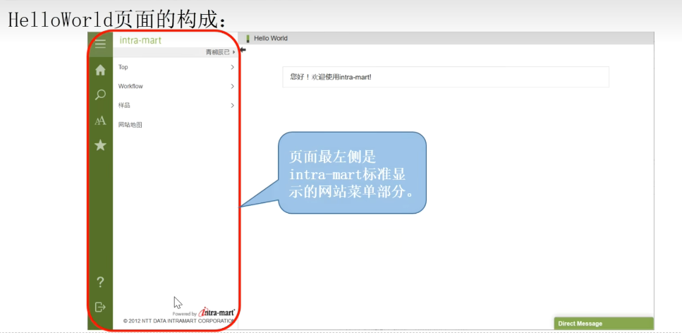
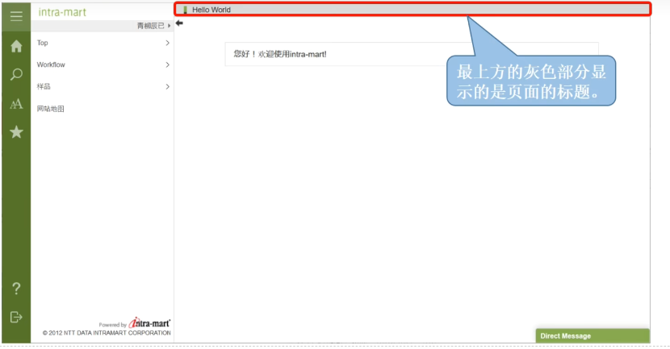
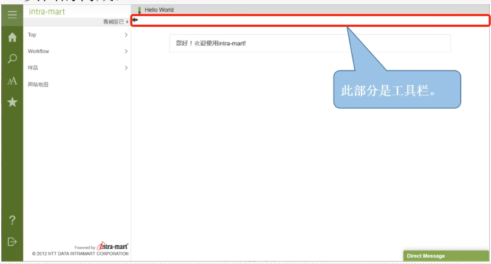
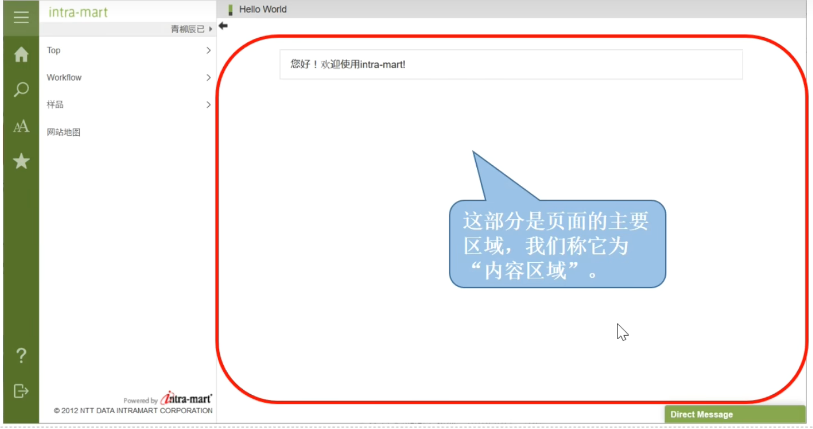

# 脚本开发入门

## 什么是脚本开发模式

html + JS  
html文件被称为Presentation Page

- html主要实现UI部分, 这里主要由一般的html标签 + intra-mart自己的imart标签组成
- 可以和服务器端的js文件进行对接

JS被称为Function Container  
JS主要实现业务逻辑 这里可以使用JS API也可以使用intra-mart API  
**html文件和JS文件必须同名**

## intra-mart页面

## init方法和全局变量

- init() 初始化方法 在最开始被执行
- 所以执行顺序为 先init() -> 再读取Presentation Page -> Presentation Page中的imart标签的value属性接收全局变量中的值后显示到页面
